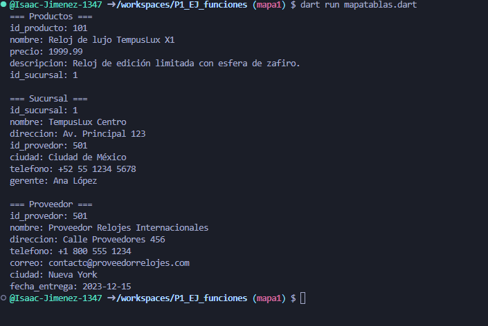

*TempusLux (tienda de relojes), el nombre principal de ese map sera productos los key son los siguientes:
id_producto
nombre
precio
descripcion
id_sucursal

el segundo sera sucursal con los siguientes key
id_sucursal
nombre
direccion
id-provedor
ciudad
telefono
gerente

el tercero sera "provedor" con los siguientes key
id_provedor
nombre
direccion
telefono
correo
ciudad
fecha_entrega*

*Salida de datos*

